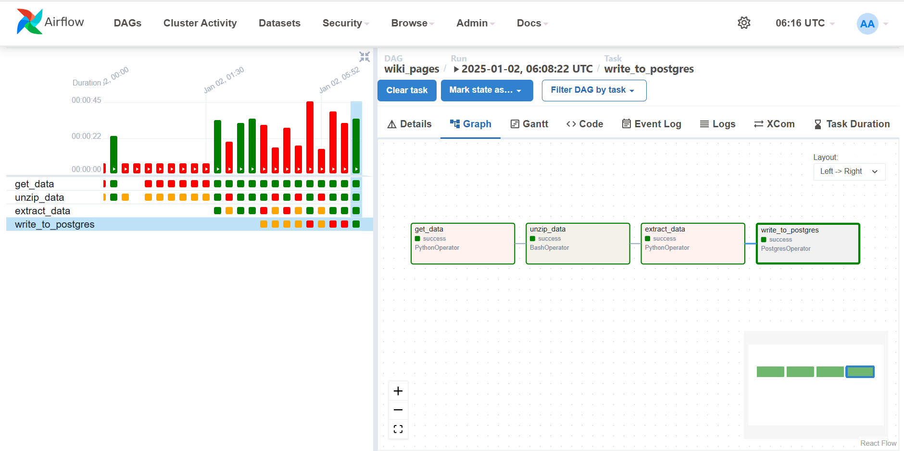
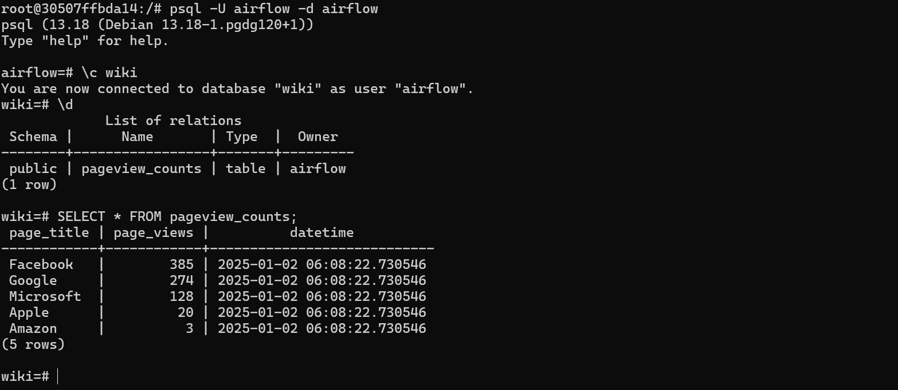

# Airflow-Hourly Wikipedia Pageviews Pipeline with Batch Streaming

This project demonstrates the use of **Apache Airflow** to orchestrate the extraction, processing, and storage of hourly pageview data from Wikipedia. The pipeline utilizes **batch streaming** to fetch hourly pageview data, process it to extract views for specific pages, and store the results in a **PostgreSQL** database. All components are orchestrated and executed seamlessly using **Docker**.

---

## DAG

---

## Project Overview

### Key Features
- **Apache Airflow DAG**: Manages the sequence of tasks to ensure data processing flows efficiently.
- **Batch Streaming Workflow**: Processes Wikipedia pageview data in hourly batches to maintain real-time relevance.
- **Python and Bash Operators**: Utilizes Python for data processing and Bash for command execution.
- **PostgreSQL Database**: Stores extracted data for further analysis or visualization.
- **Dockerized Environment**: Ensures consistent execution across different systems with containerized services.

---

## Workflow Steps

1. **Batch Streaming with Wikipedia Pageview Data**
   - The pipeline fetches hourly data dumps, ensuring data relevance and real-time insights.
   - A **PythonOperator** downloads compressed pageview data for a specific hour using a dynamically constructed URL.
   - The URL is formatted based on the **execution_date** provided by Airflow.

2. **Unzip the Data**
   - A **BashOperator** unzips the downloaded `.gz` file to make the raw data accessible for processing.

3. **Extract Relevant Pageview Data**
   - A **PythonOperator** parses the unzipped file, extracting hourly pageview counts for a predefined set of popular pages (`Google`, `Amazon`, `Apple`, `Microsoft`, `Facebook`).
   - Constructs and saves a series of SQL `INSERT` statements to a file for database insertion.

4. **Write Data to PostgreSQL**
   - A **PostgresOperator** executes the SQL file to store the extracted data in a **PostgreSQL** table.

---

---

## Technologies Used

### **Apache Airflow**
- Orchestrates the pipeline using a Directed Acyclic Graph (DAG).
- Ensures tasks execute in the correct sequence with proper dependency handling.
- Key Parameters:
  - `dag_id`: Unique identifier for the DAG.
  - `start_date`: Determines when the pipeline begins execution.
  - `template_searchpath`: Allows dynamic templating of paths or queries.

### **Batch Streaming**
- The project processes Wikipedia pageview data in batches (hourly).
- Ideal for handling real-time data without overwhelming the system.

### **Docker**
- Provides a containerized setup for Airflow, PostgreSQL, and other services.
- Ensures the pipeline runs seamlessly in any environment without dependency issues.

### **PostgreSQL**
- Stores processed pageview counts for further analysis.
- The data structure is dynamically generated via SQL scripts created during the data extraction step.

---

## Benefits of Batch Streaming
- **Scalability**: Efficiently processes hourly chunks of data, minimizing resource strain.
- **Real-time Insights**: Maintains up-to-date information by processing smaller, regular data batches.
- **Fault Tolerance**: Easier to recover from errors by reprocessing specific timeframes without affecting the entire dataset.

---

